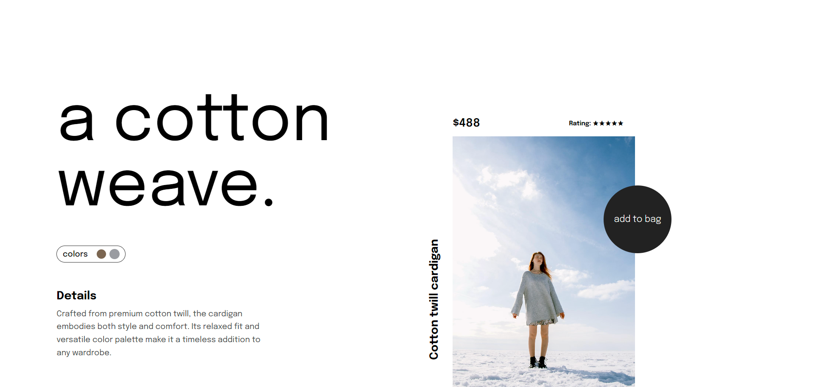

# A Cotton Weave: Product Hero Section Design

This repository contains the code for a modern product hero section design. The design emphasizes a clean layout and visually appealing elements to highlight a cotton twill cardigan.

## Design Overview

- **Clean Layout**: The design features a well-structured layout that guides the user's eye towards the key elements.
- **Minimalist Color Palette**: A neutral color scheme with a touch of warmth creates a sophisticated feel.
- **Interactive Elements**: Hover effects on color options and the "Add to Bag" button enhance user engagement.
- **Responsive Design**: The design adapts to different screen sizes, ensuring a consistent user experience across devices.

**The design is focused on showcasing the product's key features and encouraging users to explore it further.**